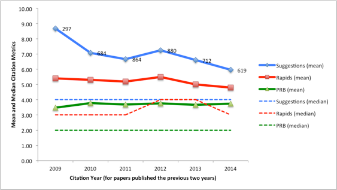
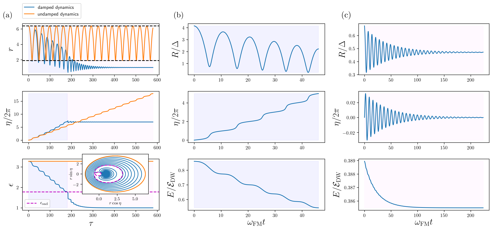

# Python Demo

&nbsp;

This demo uses Python to showcase some web scraping, data analysis, and data visualisations, e.g. *Figures 1 and 2.* 

In the [first part](#part1), I perform some simple web scraping and statistical analysis to explore the impact of "**Editor's Suggestion**" -- a feature of the world's largest physics journal Physical Review B (PRB) whereby a handful of publications are highlighted out of the 90 or so published each week.
<!-- I have released the tools developed for the web scraping in a dedicated Python package on GitHub [here](). -->

In the [second part](#part2), I give details about the construction of a few data visualisations I made for my first scientific paper which was featured in PRB's Editor's Suggestions in 2019.
The tools used included Python, Wolfram Mathematica, and Inkscape.

<div style="display:block;">
<iframe src="{{ "/assets/images/mychart2.html" | prepend: site.baseurl }}" width="100%" height="490px" frameBorder="0"></iframe>
</div>
<figcaption style="font-style:italic; text-align: center; margin-bottom: 50px;"> 
    Fig. 1. Citation metrics for papers published by Physical Review B in 2019, made with the Python package <a href="https://altair-viz.github.io/index.html">Altair</a>.
    Hovering over different bars can display some interesting information. Data scraped from PRB's website using the  <a href="https://scrapy.org/">Scrapy</a> library.
    Left: Citations from papers published in 2019, broken down by sub-fields of condensed matter and materials physics.
    Right: Horizontal bar chart of the top twenty articles published in 2019, with different colours for highlighted and non-highlighted articles.
    Highlighted papers cover a sizeable fraction of the top-cited papers.
</figcaption>
 
<iframe src="{{ "/assets/images/skyrmion.html" | prepend: site.baseurl }}"  width="100%" height="610px"></iframe>
<figcaption style="font-style:italic; text-align: center;"> 
    Fig. 2. An interactive visualisation of a <a href="https://en.wikipedia.org/wiki/Magnetic_skyrmion" >magnetic skyrmion</a>, made with the <a href="https://plotly.com/graphing-libraries/">Plotly</a> Python library, as found in chiral ferromagnetic thin film systems such as a bilayer of PdFe on an Ir(111) single crystal substrate (see for example <a href="http://dx.doi.org/10.1103/PhysRevLett.114.177203">here</a>).
    Cones of unit length represent spins describing the local magnetization field inside a slice of the magnetic material. 
    An extended core of spins point downwards in the center of the skyrmion. 
    Extending radially outwards from there, the spins continuously rotate until all are pointing upwards far away from the core, where the material is uniformly magnetized.
    Click/drag/scroll with the mouse to change the perspective.
</figcaption>


&nbsp;


<a name="part1"></a>


## Part 1: Investigating the impact of Editor's Suggestion in Physical Review B

Many scientific publishers have adopted a *highlights* feature for papers which are deemed to be of higher quality than most, or are otherwise considered to be influential.
PRB's own discussion about the impact of highlighting can be read [here](https://journals.aps.org/prb/edannounce/PhysRevB.92.210001). 

To supplement this part of the demo, full details are available in three accompanying Jupyter notebooks:

1. Notebook for [full details on the web scraping.](https://github.com/bfmkr/portfolio/blob/main/assets/notebooks/Web-scraping-Physical-Review-B-workbook.ipynb)
2. Notebook for [example usage of the developed Python package.](https://github.com/bfmkr/portfolio/blob/main/assets/notebooks/Sample-notebook-for-scraping-publication-data-from-PRB-in-2019.ipynb)
3. Notebook for [more data analysis and visualisations](https://nbviewer.org/github/bfmkr/portfolio/blob/main/assets/notebooks/Data-Analysis-and-Visualisations-PRB-dataset.ipynb).


### Web scraping one issue (99/5) and gathering summary statistics

For the data collection, I opted to use the Python library [Scrapy](https://scrapy.org/) to crawl through the website of Physical Review B and locate the number of citations for each paper.

The basic strategy is as follows: from the web URL for a particular weekly PRB issue, in this case <https://journals.aps.org/prb/issues/99/5#>, the DOIs (digital object identifiers) to collect for different research papers can be found in the `data-id` attribute of `div` tags, as seen by using "Inspect element" in the web browser:

```html
<div class="content">
    <div class="article panel article-result" data-id="10.1103/PhysRevB.99.054201">...</div>
    <div class="article panel article-result" data-id="10.1103/PhysRevB.99.054202">...</div>
    ...
</div>
```

Each DOI uniquely identifies a research paper. 
Collecting them all into a list of strings in Python is straightforward:

```python
from scrapy import Selector
import requests

url = 'https://journals.aps.org/prb/issues/99/5#'
html = requests.get(url).content
sel = Selector(text = html)
dois = sel.xpath('//div[@class="article panel article-result"]/@data-id').extract()
unique_dois = list(set(dois))  # ensures no duplicates
```

From the `unique_dois` list, we can navigate to the research paper's dedicated webpage by appending each DOI to *https://journals.aps.org/prb/abstract/*.
From there, the number of citations can be extracted by locating the correct `div` element by using a different XPath.

In each weekly issue, the journal also sorts each research paper into different sections in condensed matter physics. 
It will be useful to additionally locate to which section each research paper belongs in order to compare the different sub-fields to each other. 
In the full scraping Python code, available [here](https://github.com/bfmkr/portfolio/blob/main/assets/notebooks/Web-scraping-Physical-Review-B-workbook.ipynb), I collect this information into a Python dictionary `sections_dict` which contains `{DOI: section}` key-value pairs.

Similarly, a Python dictionary `citations_dict` contains the `{DOI: num_citations}` key-value pairs.
With this minimal information, by loading the data into a Pandas DataFrame we can easily investigate some interesting summary statistics. 
We can also identify whether or not each article has been highlighted, in order to address the impact of highlighting:

```python
import pandas as pd

# Construct a DataFrame which also includes the section info for each article
df = pd.DataFrame({'section': sections_dict,'prb_citations': citations_dict})

# Retrieving DOIs for the 5 highlighted articles in this issue
selector = sel.xpath('//a[@name="sect-highlighted-articles"]')
highlighted_articles = selector.xpath('../div[@class="article panel article-result"]/@data-id').extract()

# Loading this information into a new column in the DataFrame:
is_highlighted_dict = dict()

for i, article in enumerate(df.index):
    if article in highlighted_articles:
        is_highlighted_dict[article] = True
    else:
        is_highlighted_dict[article] = False

is_highlighted_series = pd.Series(is_highlighted_dict)
df["is_highlighted"] = is_highlighted_series
```

A sample of the obtained dataframe, via `df.head()`, is as follows

<div style="text-align:center;">
<table style="display: inline-table; font-size: 10pt;" >
  <thead>
    <tr style="text-align: right;">
      <th></th>
      <th>section</th>
      <th>prb_citations</th>
      <th>is_highlighted</th>
    </tr>
  </thead>
  <tbody>
    <tr>
      <th>10.1103/PhysRevB.99.054101</th>
      <td>sect-articles-structure-structural-phase-transitions-mechanical-properties-defects</td>
      <td>7</td>
      <td>False</td>
    </tr>
    <tr>
      <th>10.1103/PhysRevB.99.054102</th>
      <td>sect-articles-structure-structural-phase-transitions-mechanical-properties-defects</td>
      <td>13</td>
      <td>True</td>
    </tr>
    <tr>
      <th>10.1103/PhysRevB.99.054103</th>
      <td>sect-articles-structure-structural-phase-transitions-mechanical-properties-defects</td>
      <td>19</td>
      <td>False</td>
    </tr>
    <tr>
      <th>10.1103/PhysRevB.99.054104</th>
      <td>sect-articles-structure-structural-phase-transitions-mechanical-properties-defects</td>
      <td>3</td>
      <td>False</td>
    </tr>
    <tr>
      <th>10.1103/PhysRevB.99.054105</th>
      <td>sect-articles-structure-structural-phase-transitions-mechanical-properties-defects</td>
      <td>58</td>
      <td>False</td>
    </tr>
  </tbody>
</table>
</div>

and summary statistics by section are readily obtained by `df.groupby("section").describe()`:

<div style="text-align:center;">
<table style="display: inline-table; font-size: 10pt;" >
  <thead>
    <tr>
      <th></th>
      <th colspan="8" halign="left">prb_citations</th>
    </tr>
    <tr>
      <th></th>
      <th>count</th>
      <th>mean</th>
      <th>std</th>
      <th>min</th>
      <th>25%</th>
      <th>50%</th>
      <th>75%</th>
      <th>max</th>
    </tr>
    <tr>
      <th>section</th>
      <th></th>
      <th></th>
      <th></th>
      <th></th>
      <th></th>
      <th></th>
      <th></th>
      <th></th>
    </tr>
  </thead>
  <tbody>
    <tr>
      <th>sect-articles-dynamics-dynamical-systems-lattice-effects</th>
      <td>8.0</td>
      <td>18.875000</td>
      <td>18.271269</td>
      <td>1.0</td>
      <td>7.50</td>
      <td>10.0</td>
      <td>30.75</td>
      <td>49.0</td>
    </tr>
    <tr>
      <th>sect-articles-inhomogeneous-disordered-and-partially-ordered-systems</th>
      <td>11.0</td>
      <td>17.272727</td>
      <td>13.900294</td>
      <td>2.0</td>
      <td>8.50</td>
      <td>14.0</td>
      <td>22.00</td>
      <td>50.0</td>
    </tr>
    <tr>
      <th>sect-articles-magnetism</th>
      <td>36.0</td>
      <td>16.638889</td>
      <td>18.825746</td>
      <td>2.0</td>
      <td>5.00</td>
      <td>11.0</td>
      <td>16.25</td>
      <td>80.0</td>
    </tr>
    <tr>
      <th>sect-articles-structure-structural-phase-transitions-mechanical-properties-defects</th>
      <td>7.0</td>
      <td>21.142857</td>
      <td>19.221763</td>
      <td>3.0</td>
      <td>10.00</td>
      <td>13.0</td>
      <td>27.00</td>
      <td>58.0</td>
    </tr>
    <tr>
      <th>sect-articles-superfluidity-and-superconductivity</th>
      <td>20.0</td>
      <td>10.900000</td>
      <td>14.863944</td>
      <td>1.0</td>
      <td>3.75</td>
      <td>5.5</td>
      <td>10.00</td>
      <td>59.0</td>
    </tr>
  </tbody>
</table>
</div>

Gathering summary statistics in this manner is a useful first step to apply broadly to understand a dataset.
For example, in the magnetism section 75% of all articles have less than or equal to 16.25 citations, this section is the largest one in this issue with 36 papers in total, and its top-cited paper has gained 80 citations.

Next, by combining Pandas with [Matplotlib](https://matplotlib.org/), we can generate a histogram colour-coded by the different sections of condensed matter physics to visualise the data.
The resulting plot is shown in the left panel of *Fig. 3*.

<main style="content: ''; display:table; clear: both;">
  <div style="float: left; width: 45%;">
    
  </div>
  <div style="font-size:9pt; float: left; width: 55%; height:100%; margin-top:130px;">
    <table class="dataframe">
      <thead>
        <tr style="text-align: right;">
          <th></th>
          <th>section</th>
          <th>prb_citations</th>
          <th>is_highlighted</th>
        </tr>
      </thead>
      <tbody>
        <tr>
          <th>10.1103/PhysRevB.99.054102</th>
          <td>sect-articles-structure-structural-phase-trans...</td>
          <td>13</td>
          <td>True</td>
        </tr>
        <tr>
          <th>10.1103/PhysRevB.99.054404</th>
          <td>sect-articles-magnetism</td>
          <td>75</td>
          <td>True</td>
        </tr>
        <tr>
          <th>10.1103/PhysRevB.99.054430</th>
          <td>sect-articles-magnetism</td>
          <td>28</td>
          <td>True</td>
        </tr>
        <tr>
          <th>10.1103/PhysRevB.99.054505</th>
          <td>sect-articles-superfluidity-and-superconductivity</td>
          <td>59</td>
          <td>True</td>
        </tr>
        <tr>
          <th>10.1103/PhysRevB.99.054516</th>
          <td>sect-articles-superfluidity-and-superconductivity</td>
          <td>46</td>
          <td>True</td>
        </tr>
      </tbody>
    </table>
  </div>
</main>

<figcaption style="text-align:center; font-style:italic; margin-top:30px; margin-bottom:50px;">
    Fig. 3. Left: As to be expected, the distribution of citation counts is not symmetrical; most papers receive between 1 and 20 citations, and there are also a few outliers for highly cited papers.
    Right: Data for just the highlighted articles via <code style="font-style:normal;">df[df["is_highlighted"]]</code>. 
    A cursory look at the histogram shows that the highlighted articles aren't necessarily the most highly cited ones -- while the second-most cited paper with 75 citations was highlighted, the top cited one has 80 citations and was not highlighted.
</figcaption>  

Due to the asymmetry of the data and the outliers for highly cited papers, using the median is a better way to describe the typical result rather than the mean.

<div>
  \begin{align}
  \text{median(all data from 99/5)} &= 10 \text{ citations} \notag \\
  \text{median(just highlighted)} &= 46 \text{ citations} \notag
  \end{align}
</div>


### Extension to all data from 2019

The dataset above for a single issue with just 5 highlighted papers is not large enough to draw any convincing conclusions about the impact of highlighting; here we extend the investigation to all 48 issues from 2019.
To keep this demo from becoming too long, from now on we will focus on interpreting a sample of data visualisations -- for further Python code details please refer to the [accompanying](https://nbviewer.org/github/bfmkr/portfolio/blob/main/assets/notebooks/Data-Analysis-and-Visualisations-PRB-dataset.ipynb) [jupyter](https://github.com/bfmkr/portfolio/blob/main/assets/notebooks/Web-scraping-Physical-Review-B-workbook.ipynb) [notebooks](https://github.com/bfmkr/portfolio/blob/main/assets/notebooks/Sample-notebook-for-scraping-publication-data-from-PRB-in-2019.ipynb).

In addition to the fields described previously, for each research paper I have also extracted information for the date of publication, author names, and article name.
This can be seen in the "Top twenty papers" chart in *Fig. 1* at the top of this webpage where hovering over different horizontal bars displays the metadata for each research paper.
The full dataset with citation numbers collected on 25 Aug 2023 is available for download [here](https://github.com/bfmkr/portfolio/blob/main/assets/notebooks/data/data_2023-08-25.csv).

PRB themselves investigated the number of citations accumulated by papers over the previous 2 years, for different years from 2009-2014, and compared the results for highlighted papers to non-highlighted ones, *Fig. 4.*


*Fig. 4 Citations for PRB papers published in the previous two years ([source](https://journals.aps.org/prb/edannounce/PhysRevB.92.210001)). The median paper selected for Editor's Suggestion gained 4 citations, while the median paper overall gained just 2 citations. ("Rapids" was a feature for accelerated publication of new results and was deprecated in December 2020 in favour of "Letters")*

Looking at overlapping sub-periods in this manner is a useful approach for looking for trends in time series data.
Unfortunately we cannot repeat this style of investigation with the information available from PRB, because the journal's website only provides the most recent value of citations for each publication rather than the full historical data. 
However, we can still learn some interesting facts by exploring the dataset. 

For example, *Fig. 5* displays the distribution of citations received by the highlighted papers alongside the distribution of citations for the rest of the research papers. 
This is much more convincing than the results from a single issue; as we can see, the distribution for highlighted papers covers a notably larger area to the right, corresponding to a greater share of citations per paper. 
The subset of highlighted papers also contains many of the most-cited papers. 
This can be seen most directly in the figure at the top of this page (*Fig. 1*), where 11 out of the top 20 papers in 2019 were highlighted by the authors. 

<div>
    <iframe src="{{ "/assets/images/citations_distribution.html" | prepend: site.baseurl }}" width="100%" height="500px" seamless frameborder="0"></iframe>
</div>
<figcaption style="font-style:italic; text-align: center; margin-bottom: 50px;"> 
    Fig. 5. Dual y-axis histogram chart for highlighted papers versus non-highlighted papers in 2019 with bin width = 5. <br> 
    Scroll with the mouse wheel and drag to zoom in and move around. Double-click on the figure to reset the view.
</figcaption>

Due to highlighted papers being a relatively small sample of the full dataset, the distribution shown in red in *Fig. 5* is not as smooth as the blue one.
It is also notable that highlighted papers have a significantly larger standard deviation than the full dataset, which can be attributed to highlighted papers containing a larger proportion of outliers for highly cited papers: 

<div>
  \begin{align}
  \text{std(just highlighted papers)} &= 44.5 \text{ citations} \notag \\
  \text{std(all papers in dataset)} &= 18.4 \text{ citations} \notag
  \end{align}
</div>

Technically speaking, the difference in spread of citations suggests also that highlighted papers are not a good representative sample of the full dataset.
To be more precise, highlighted papers account for 264/4473 = 5.9% of all published research papers in 2019, while their share of the total number of citations is greater than this at 13.9%. 
We can therefore broadly say that Editor's Suggestion is a successful feature, because highlighted papers in aggregate account for more than their share of citations.

Some additional summary statistics extracted using Pandas also support the success of highlighting papers in Editor's Suggestion:

<div>
  \begin{align}
  \text{mean(just highlighted papers)} &= 32.9 \text{ citations} \notag \\
  \text{mean(all papers in dataset)} &= 14.0 \text{ citations} \notag \\
  \text{median(just highlighted papers)} &= 19.0 \text{ citations} \notag \\
  \text{median(all papers in dataset)} &= 9.0 \text{ citations} \notag 
  \end{align}
</div>

We might also be interested in a more granular view of our data, wondering if the editors *always* managed to identify which papers would be received best by the community in a given issue (usually published weekly). *Fig. 6* shows the proportion of citations gained by just the highlighted papers on the left, drilled down across the 48 different issues, with a simple binary colour code to indicate the overall success (or not) of highlighted papers in each issue. 

<div>
    <iframe src="{{ "/assets/images/proportion_citations_highlighted1.html" | prepend: site.baseurl }}" width="100%" height="410px" seamless frameborder="0"></iframe>
</div>
<figcaption style="font-style:italic; text-align: center; margin-top: 10px; margin-bottom: 50px;"> 
    Fig. 6. Left: Proportion of citations gained by highlighted papers in each issue. 
    Hover over the vertical bars to see the details used to evaluate the <code>editor_success</code> measure. 
    Right: Distribution of the % citations received by highlighted papers within issues.
    By shift-clicking combinations of bars on the left chart the histogram on the right can be constructed.
    Double-click on the chart to reset to the initial state.
</figcaption>

To explain the `editor_success` colour code, for example, 4 out of 87 papers were highlighted in issue 99/1, which is smaller than the value of 6.1% which is the proportion of citations earned by those papers. Hence highlighted papers earned more than their share of citations in this issue which means `editor_success = True`. 
On the right of *Fig. 6*, we can see the distribution of the same data to the left. 
From this view of the data, we can see that 7 issues had highlighted papers accounting for between 8-10% of total citations which is the modal value for the 2%  bin width.

Further summary statistics of note for highlighted papers grouped by issue are as follows:

<div>
  \begin{align}
  \text{mean(highlighted papers per issue)} &= 5.5 \notag \\
  \text{min(highlighted papers within an issue)} &= 2 \quad \text{(issues 99/6 and 99/17)} \notag \\
  \text{max(highlighted papers within an issue)} &= 11 \quad \text{(issue 100/3)} \notag
  \end{align}
</div>

This shows that the editors do not simply always pick the same number of articles to highlight each week, but instead likely select articles according to a mixture of criteria such as feedback from peer review.

For a variation on the information contained in *Fig. 6*, *Fig. 7* sorts the issues from most successful to least successful regarding the impact of highlighting papers in Editor's Suggestion. Here, the success of highlighted papers within an issue is quantified comparing the percentage of citations received by highlighted papers to the proportion of highlighted papers within that issue. 
It turns out that the editors were successful 39/48 = 81.25% of the time using this rather simple/generous measure of success. 
The spread of this measure of success is quite large however, as it ranges from +26.5% to -1.5%.

Note that we could have instead decided on classifying the success (or not) of a highlighted paper by its number of citations being within a certain percentile, say within the top 5% of papers, which could impact the exact number of issues that are classed as a success for the editors.

<div>
    <iframe src="{{ "/assets/images/most-successful-to-least-successful-issues.html" | prepend: site.baseurl }}" width="100%" height="410px" seamless frameborder="0"></iframe>
</div>
<figcaption style="font-style:italic; text-align: center; margin-top: 10px; margin-bottom: 50px;"> 
    Fig. 7. Quantifying the success of highlighted papers in different issues. 
    For the simple measure of success, the y-axis shows the difference between the % of citations received by highlighted papers and the % of highlighted papers in that issue.
</figcaption>


We can also drill down by section to see if the editors were better at highlighting papers in certain sub-fields of condensed matter physics more than others. *Fig. 8* suggests the section *Inhomogeneous, disordered, and partially ordered systems* was the easiest for editors to accurately highlight the best papers. 
This should be taken with a grain of salt however because only 9 papers were highlighted in this section throughout the whole year -- in contrast, the next most successful section for the editors was *Electronic structure and strongly correlated systems* and had 100 highlighted papers.

<div>
    <iframe src="{{ "/assets/images/proportion_highlighted_by_section.html" | prepend: site.baseurl }}" width="100%" height="380px" seamless frameborder="0"></iframe>
</div>
<figcaption style="font-style:italic; text-align: center; margin-top: 10px; margin-bottom: 50px;"> 
    Fig. 8. Chart of the percentage of citations earned by just highlighted papers within each section. 
    In comparison, Fig. 1 (left) showed the absolute number of citations gained by all papers within each section.
</figcaption>

By analogy to how *Fig. 7* quantified the success of highlighting within different issues by analysing the data in *Fig. 6*, we can similarly order the most successful to least successful sections by subtracting the % of highlighted papers per section from the % of citations gained by highlighted papers within the section, *Fig. 9*. 
It should be noted that this measure of success treats each section equally, which is a dubious proposition given that the different sub-fields do not receive the same amount of funding (or attention from the editors for highlighting). 
A comparison of the different sections weighted by the amount of funding/attention they receive would be an fairer comparison than this simple approach; similarly, we would also want to combine the two *Semiconductors* sections when performing a more accurate breakdown.


<div>
    <iframe src="{{ "/assets/images/most_successful_to_least_successful_sections.html" | prepend: site.baseurl }}" width="100%" height="380px" seamless frameborder="0"></iframe>
</div>
<figcaption style="font-style:italic; text-align: center; margin-top: 10px; margin-bottom: 50px;"> 
    Fig. 9. Quantifying the success of highlighted papers within each section. For the simple measure of success, the y-axis shows the difference between the % of citations received by highlighted papers and the % of highlighted papers in that section.
</figcaption>

The largest bar in *Fig. 9* corresponds to the most successful section and is *Inhomogeneous, disordered, and partially ordered systems*. 
Again, however, the editors only highlighted 9 papers in this section throughout the whole year so the sample size is too small to be convincing. 
Comparing data across multiple years would reveal if the editors of PRB truly are better at identifying high impact papers in this sub-field more than others.

For fun, since we have already extracted the author names for each publication, we can also investigate briefly if the number of authors has an impact on the success of a paper.
*Fig. 10* shows a scatter plot of the number of authors versus the number of citations for each paper, with highlighted papers identified in orange, alongside the distribution of the number of authors.

<div>
    <iframe src="{{ "/assets/images/citations_vs_num_authors.html" | prepend: site.baseurl }}" width="100%" height="470px" seamless frameborder="0"></iframe>
</div>
<figcaption style="font-style:italic; text-align: center; margin-bottom: 50px;"> 
    Fig. 10. Left: Number of citations versus number of authors scatter plot. 
    Hovering over individual points with the cursor displays metadata for the individual research papers.
    Zoom in on individual points by using the mouse wheel and clicking and dragging the canvas.
    Right: Histogram of the number of authors. The most common number of authors on research papers was 3.
</figcaption>

The scatter plot in *Fig. 10 (left)* shows there is a cluster of 5 highest cited papers above 200 citations, all of which are highlighted articles, which had between 2 and 7 authors. 
We can also see that no papers have >100 citations when the number of authors exceeds 7. Moreover, the extended tail to the right suggests that as the number of authors increases further than 7, the impact of a paper appears to decrease.


### Conclusions

In this demo we scraped data for all publications in Physical Review B from 2019 to address the impact of highlighting papers in "Editor's Suggestion". 
By investigating the data collected, we found:

* The editors managed to identify papers with higher than average impact around 80% of the time.
* Within a given weekly issue, highlighted papers account for a typical (modal) value of between 8-10% of the total share of citations (*Fig. 6*, right), while they only account on average for 5.5% of the papers published.
* The most successful sections for the editors selecting papers to highlight were *Inhomogeneous, disordered, and partially ordered systems* followed by *Electronic structure and strongly correlated systems.*
* The majority of research papers had 3 authors, and as the number of authors continues to increase beyond 7 the impact of research papers decreases in aggregate.

<a name="part2"></a>


## Part 2: Data visualisations from a paper highlighted in Editor's Suggestion

### Introduction

On the 26th of February 2019, my publication in Physical Review B was featured on the highlights page for the journal as it had been selected for **Editor's Suggestion**, *Fig. 11*.
Eighty one other papers were published in the same issue of the journal, out of which four others were similarly highlighted.


*Fig. 11. Highlights page of Physical Review B, Feb 26th 2019*

At the time of writing this, more than four years later, the paper we published has gained [32 citations](https://scholar.google.com/scholar?cites=17207350684433670652&as_sdt=2005&sciodt=0,5&hl=en).
Regardless of the reason for being selected as a highlighted paper, I spent significant time and attention ensuring we used a consistent colour scheme across all figures, such that the essence of the story we were telling was quickly evident without needing to scan through detailed walls of text.

In this part, I wish to write a few details about the construction of a few of those figures.


### First, some animations and a bit of physics

The main problem we addressed in our manuscript involved an excitation of [magnetic skyrmions](https://en.wikipedia.org/wiki/Magnetic_skyrmion) known as their "breathing" dynamics.
This is where the skyrmion -- a cylindrically-shaped deformation in the magnetization field of a ferromagnet that is otherwise uniformly magnetized, *see Fig. 2* -- appears to grow and shrink in size. 
This was first predicted by [eigenmode studies](https://journals.aps.org/prb/abstract/10.1103/PhysRevB.89.024415) of the magnetization dynamics (though it is an intrinsically non-linear phenomenon), and it was later [experimentally measured](https://journals.aps.org/prl/abstract/10.1103/PhysRevLett.109.037603) in the skyrmion crystal phase of the helimagnetic insulator Cu2SeO3 where a periodic arrangement of skyrmions breathes coherently.
Our paper focused on capturing an effective model for the non-linear breathing of a single *isolated* skyrmion within the ferromagnetic phase of chiral magnets.

During the breathing dynamics, the skyrmion retains its hallmark circular shape during the motion; and, at the same time, the magnetic spins comprising the skyrmion collectively precess around their equilibrium (at-rest) values.
Animations of breathing skyrmions made in Python are shown in *Fig. 12* below, using data from numerical integration of a derived system of equations.

<main style="content: ''; display:table; clear: both;">
    <div style="text-align:center; float: left; width: 50%;">
        <video width="640" height="512" controls loop autoplay>
            <source src="assets/animations/rots.mp4" type="video/mp4">
        </video> 
    </div>
    <div style="text-align:center; float: left; width: 50%;">
        <video width="640" height="512" controls loop autoplay>
            <source src="assets/animations/oscs.mp4" type="video/mp4">
        </video>
    </div>
</main>

<figcaption style="text-align:center; font-style:italic; margin-top:10px; margin-bottom:20px;">
    Fig. 12. Animations of the two characteristic types of breathing of isolated magnetic skyrmions, created with Plotly and ffmpeg. <br> 
    Left: High energy, rotational, breathing behaviour, where the phase \(\eta\) is always increasing. (Here counter-clockwise) <br>
    Right: Lower energy, oscillatory, breathing behaviour where \(\eta\) oscillates around equilibrium.
</figcaption>  

The code used to make the single skyrmion visualisation example shown in *Fig. 2* near the top of this demo is displayed below.
This was extended to create the animations of breathing skyrmions shown in *Fig. 12*, in which the radius \\( r \\) and skyrmion phase \\( \eta \\) vary in time.

```python
import numpy as np
import plotly.graph_objects as go
import plotly.offline as pl

R = 10     # radius
eta = 0    # skyrmion phase
Delta = 2  # skyrmion's domain wall width

def calc_conefield2D(x,y):
    """Returns a Plotly Cone object at a point in the (x,y) plane"""

    # plane polar coordinates
    psi = np.arctan2(y,x)
    rho = np.sqrt(x**2 + y**2)
    
    # 360 degree domain wall ansatz for an axisymmetric skyrmion
    # np.around used because plotly.js doesn't like full precision float64s
    mx = np.around(np.cos(eta+psi)/np.cosh((rho-R)/Delta),decimals=5)
    my = np.around(np.sin(eta+psi)/np.cosh((rho-R)/Delta),decimals=5)
    mz = np.around(np.tanh((rho - R)/Delta),decimals=5)
    
    return go.Cone(x=[x],y=[y],z=[0],
                   u=[mx],v=[my],w=[mz],
                   anchor='cm',
                   sizemode='scaled',
                   sizeref=1.5,
                   showscale=False)

conedata = [calc_conefield2D(x,y) for x in np.arange(-25,25,3) for y in np.arange(-25,25,3)]

layout = go.Layout(
    width=1250,
    height=650,
    autosize=False,
    scene=dict(
        camera=dict(eye=dict(x=0.55,y=0.90,z=0.90)), # adjust norm of `eye` to zoom
        xaxis=dict(range=[-25,25],showbackground=False,visible=False),
        yaxis=dict(range=[-25,25],showbackground=False,visible=False),
        zaxis=dict(range=[-25,10],showbackground=False,visible=False)
    )
)

fig = go.Figure(data=conedata, layout=layout)
fig.update_layout(
    title='<b>Interactive magnetic skyrmion visualisation made with Plotly</b>',
    title_x=0.5
)

pl.plot(fig,filename='skyrmion.html',auto_open=False)
fig.show()
```

For full details on the creation of the animations and some further information on the physics, please see the accompanying [jupyter notebook](https://github.com/bfmkr/portfolio/blob/main/assets/notebooks/Skyrmion-breathing-animation-for-the-domain-wall-ansatz.ipynb).
To keep the discussion here reasonably short but still self-contained, the following nonlinear dynamical system of equations was numerically solved using Python to produce *Fig. 12*:

<div>
    \begin{align}
    \dot{r}
    &= -\frac{1}{1+\alpha^{2}}\left( 2g\sin\eta + \alpha |g|\frac{\varepsilon r-2|g|}{r^{3}}  \right) \\
    \dot{\eta}
    &= \frac{1}{1+\alpha^{2}}\left(\frac{\varepsilon r-2|g|}{r^{3}} - 2\alpha g|g|^{-1} \sin\eta  \right)
    \end{align}
</div>

where \\( \| g \| < 1 \\) with \\( g\neq 0\\) is a material parameter characterising the ratio of different magnetic energy contributions to the system, \\( \alpha\\) is the Gilbert damping constant from the [Landau-Lifshitz-Gilbert equation](https://en.wikipedia.org/wiki/Landau%E2%80%93Lifshitz%E2%80%93Gilbert_equation), and the \\( \varepsilon \\) is the effective energy of the skyrmion:

<div>
\begin{align}
\varepsilon = \left( \frac{1}{|g|} +|g| -2g \cos\eta \right)r +  \frac{|g|}{r}.
\end{align}
</div>


In *Fig. 12*, both breathing animations are for a skyrmion in the same material, with \\( g=0.6 \\), but different initial energies.
The oscillatory breathing skyrmion is therefore actually much smaller than the rotating breathing one but we have zoomed in and displayed the same number of spins in each animation to produce the side-by-side comparison. 
With a nonzero damping value,  \\(\alpha \neq 0\\), the breathing skyrmions in *Fig. 12* will approach the same final skyrmion configuration on long time scales.


### The figures

In our publication I created two key figures to explain the different kinds of breathing displayed in the animations of *Fig. 5* above. 
This involved visualising the effective energy function Eq. (3) as a surface plot, and the visualisations were mainly made using Wolfram Mathematica and Inkscape. 
These are reproduced in *Fig. 13* below. 

<main style="content: ''; display:table; clear: both;">
  <div style="float: left; width: 50%;">
    
  </div>
  <div style="font-size:9pt; float: left; width: 50%; height:100%; margin-top: 50px;">
        
  </div>
</main>
<figcaption style="text-align:center; font-style:italic; margin-top:30px; margin-bottom:30px;"> 
    Fig. 13. Left: Energy landscape. 
    The skyrmion undergoes rotational breathing when its energy is higher than the saddle point, and oscillatory breathing when the energy is below it. 
    Rotational breathing is illustrated by the four skyrmion configurations surrounding the energy surface plot.
    Right: Trajectories of the dynamical system in equations (1)-(2) on top of the energy landscape. (a) undamped breathing: blue corresponds to rotations (on the bowl), while pink is oscillations (in the basin). (b) a damped trajectory where the \(r,\eta\) coordinates spiral down towards their equilibrium values at the energy minimum at the bottom of the basin, at which point the skyrmion approaches a relaxed state where it is no longer breathing.
</figcaption>

The damped solution in (b) of *Fig. 13* was solved by numerical integration of Eqs. (1)-(2) in Python and the data was then imported into Mathematica to overlay on top of the energy surface plot. 
The trajectories in *Fig. 13 (a)* come from analytically derived formulas.
Full details on the numerical integration in Python for Eqs. (1)-(3) are included in the [jupyter notebook](https://github.com/bfmkr/portfolio/blob/main/assets/notebooks/Skyrmion-breathing-animation-for-the-domain-wall-ansatz.ipynb) (see section 4).

A further data visualisation I created in the paper to validate our model displayed line plots of the data, *Fig. 14*.
Here, light blue or pink backgrounds signify in which regime the breathing behaviour occurred (rotational versus oscillatory breathing respectively) for the damped dynamics example, corresponding to the bowl and basin regions in *Fig. 13* above which uses the same colour code.


*Fig. 14. Line plots describing the breathing of an isolated skyrmion. (a) shows results from numerically solving the effective model we derived in our paper (of which Eqs. (1)-(3) above are a special case), while the data used in (b) and (c) come from full micromagnetic simulations of the [Landau-Lifshitz-Gilbert equation](https://en.wikipedia.org/wiki/Landau%E2%80%93Lifshitz%E2%80%93Gilbert_equation) which is beyond the scope of this short demo.*

The orange solid lines in panel (a) show the time evolution of undamped rotational breathing (on the bowl), alongside a damped time evolution with blue solid lines which begins with rotational breathing (on the bowl) and then transitions to oscillatory breathing (in the basin).
This transition occurs because the energy dissipates and eventually drops below the saddle energy \\(\epsilon_{\text{sad}}\\) shown in *Fig. 13*, at which point \\(\eta\\) can no longer take all possible values in a level set of \\([0,2\pi)\\). 
The saddle energy is shown as a dashed magenta line in *Fig. 14a* in the bottom panel.

To round off this demo, the full lengthy Python code for producing *Fig. 7 (a)* is included below and mainly makes use of the Matplotlib and NumPy libraries:

```python
from datetime import date
import math

import numpy as np
import matplotlib
import matplotlib.pyplot as plt

# Loading the data into 1D np.ndarrays (data provided in GitHub repo)
data = np.loadtxt('effective_breathing_data.csv',delimiter=',')
t = data[:,0]
r, eta, energy = (data[:,1],data[:,2],data[:,3]) 
r_damped, eta_damped, energy_damped = (data[:,4],data[:,5],data[:,6])

# Some pre-processing of the data
B = 0.52 # material parameter, plays the role of g elsewhere in this demo
Esad = math.sqrt((1+np.abs(B))/(1-np.abs(B))) # saddle energy calculation

for n,i in enumerate(energy_damped):
    if i<Esad:
        transition_point = n # locate transition point from bowl to basin
        break
bowl_times = t[:transition_point]
basin_times = t[transition_point:]

# Setting up matplotlib parameters
SMALLEST_SIZE=10
SMALL_SIZE = 16
BIGGER_SIZE = 18
matplotlib.rc('text',usetex = True)
plt.rc('font', size=SMALL_SIZE)          # controls default text sizes
plt.rc('axes', titlesize=SMALL_SIZE)     # fontsize of the axes title
plt.rc('axes', labelsize=BIGGER_SIZE)    # fontsize of the x and y labels
plt.rc('xtick', labelsize=SMALLEST_SIZE) # fontsize of the tick labels
plt.rc('ytick', labelsize=SMALLEST_SIZE) # fontsize of the tick labels
plt.rc('legend', fontsize=SMALLEST_SIZE) # legend fontsize
plt.rc('figure', titlesize=BIGGER_SIZE)  # fontsize of the figure title
matplotlib.rcParams['figure.dpi'] = 300

# Initializing the figure
fig, ax = plt.subplots(3,sharex=True,figsize=[4.98,6.34])

# Top panel: Radius versus time line plots
ax[0].plot(t,r,label='damped dynamics')
ax[0].plot(t,r_damped,label='undamped dynamics')
ax[0].axhline(y=np.min(r), color='k', linestyle='--')
ax[0].axhline(y=np.max(r), color='k', linestyle='--')
# shade the background to show location on the energy landscape
ax[0].fill_between(bowl_times,np.min(r_damped),np.max(r),
    color='blue',alpha=0.05)
ax[0].fill_between(basin_times,np.min(r_damped),np.max(r),
    color='magenta',alpha=0.025)
# create legend at top left of figure
ax[0].legend(bbox_to_anchor=(0.0, 1.1), loc='lower left', borderaxespad=0.)
ax[0].set_ylabel(r'$r$')
          
# Middle panel: skyrmion phase in units of 2\pi versus time 
ax[1].plot(t,eta_damped/(2*math.pi))
ax[1].plot(t,eta/(2*math.pi))
ax[1].fill_between(bowl_times,np.min(eta_damped)/(2*math.pi),
    np.max(eta)/(2*math.pi),color='blue',alpha=0.05)
ax[1].fill_between(basin_times,np.min(eta)/(2*math.pi),
    np.max(eta)/(2*math.pi),color='magenta',alpha=0.025)
ax[1].set_ylabel(r'$\eta/2\pi$')

# Bottom panel: energy versus time plots
ax[2].plot(t,energy_damped)
ax[2].plot(t,energy)
ax[2].fill_between(bowl_times,np.min(energy_damped),np.max(energy),
    color='blue',alpha=0.05)
ax[2].fill_between(basin_times,np.min(energy_damped),np.max(energy_damped),
    color='magenta',alpha=0.025)

if init_energy > Esad:
    # create horizontal magenta line for saddle energy
    ax[2].axhline(y=Esad, color='m',linestyle='--',label=r'$\epsilon_{\mathrm{sad}}$')
    ax[2].legend(loc='lower left')
ax[2].set_xlabel(r'$\tau$')
ax[2].set_ylabel(r'$\epsilon$')

# Inset (bottom): 
# Trajectories on a plane polar parametric plot
# for comparison with the energy landscape figures
ax1 = plt.axes([0.50,0.175,0.37,0.18])
ax1.plot(r_damped*np.cos(eta_damped),r_damped*np.sin(eta_damped),lw=1.3)
ax1.plot(r*np.cos(eta),r*np.sin(eta),lw=1.3)
for tick in ax1.xaxis.get_major_ticks():
    tick.label1.set_fontsize(8)
for tick in ax1.yaxis.get_major_ticks():
    tick.label1.set_fontsize(8)
ax1.set_xlabel(r'$r\cos\eta$',fontsize='9')
ax1.set_ylabel(r'$r\sin\eta$',fontsize='9')
ax1.xaxis.labelpad = 0.5
ax1.yaxis.labelpad = 0.2

def trajectory(E,B,eta):
    """
    Equations for the trajectories on the
    plane polar (r\cos\eta, r\sin\eta) parametric plot.
    """
    Btheta = (1-B*np.cos(eta))/(1-np.abs(B))
    r1 = (E/Btheta)*(1+np.sqrt(1-(Btheta/(E**2))))
    r2 = (E/Btheta)*(1-np.sqrt(1-(Btheta/(E**2))))
    return r1,r2

theta  = np.linspace(0.0,2.0*math.pi,1000)
t1, t2 = trajectory(Esad,0.52,theta) # energy separatrix

ax1.plot(t2*np.cos(theta),t2*np.sin(theta), 'm--')
ax1.plot(t1*np.cos(theta),t1*np.sin(theta), 'm--')

today = str(date.today())+'.png'
fig.tight_layout()
plt.savefig(today,bbox_inches='tight')
plt.show()
plt.close()
```

<script>
MathJax = {
  svg: {
    fontCache: 'global'
  },
  tex: {
    tags: 'ams'
  }
};
</script>
<script type="text/javascript" id="MathJax-script" async
  src="https://cdn.jsdelivr.net/npm/mathjax@3/es5/tex-svg.js">
</script>