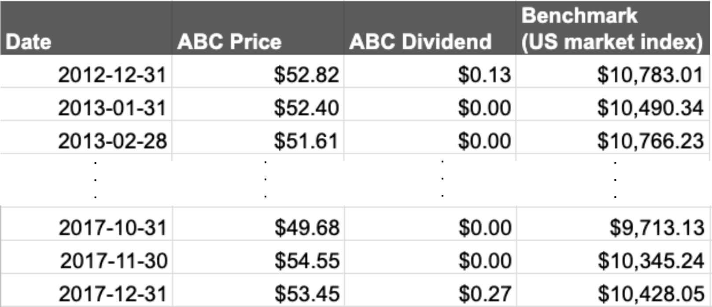

# Spreadsheet Demo 

&nbsp;

In this demo I investigate the monthly prices of a fictional stock ABC over a 3 year period, calculate simple risk and reward metrics, compare the distribution of returns to that of a theoretical Gaussian model, and finally compare the performance to the US market index as a benchmark over the same period.
The full details are available to view and download [here](https://docs.google.com/spreadsheets/d/1siknL7tF3BhBewxQRVH1tyg2vGfkvemDQxeHJDNO5k0/edit?usp=sharing).

<iframe src="https://docs.google.com/spreadsheets/d/e/2PACX-1vSGCOtI0NUWpgbHzTx1VXQdDCAQaImQRU9JR9SoJnaRovRmytICbSMLqSJkPJd2IzivHEML0-tHsq27/pubhtml?gid=558173804&amp;single=true&amp;widget=true&amp;headers=false" width="100%" height="620"></iframe>
<figcaption style="text-align: center; font-style: italic;">
    Fig. 1 Financial Analytics Dashboard for the fictional stock ABC. 
    For the best viewing experience, open the full spreadsheet workbook <a href="https://docs.google.com/spreadsheets/d/e/2PACX-1vSGCOtI0NUWpgbHzTx1VXQdDCAQaImQRU9JR9SoJnaRovRmytICbSMLqSJkPJd2IzivHEML0-tHsq27/pubhtml" title="Financial analytics spreadsheet demo"> here</a> in a new tab.
</figcaption>

All figures in this demo are interactive, embedded versions of the graphs in the spreadsheet. 
In other words, hovering the mouse cursor over the plots and clicking can display further information about the underlying data.

## The data

The raw data consisted of a series of historical prices and dividends for the stock ABC, the US market index over the same period, and the list of dates, see *Table 1*.

    

<figcaption style="text-align:center; font-style:italic;"> 
    Table 1 Sample of the raw data, from the "Main" tab of the workbook 
</figcaption>

## Breakdown of results

### Monthly stock analysis

The simplest thing we can do with the raw data is probably a line chart of the monthly stock prices, *Fig 2*. 
There is an upward trend from the lowest price, $43.63, recorded on 2015-08-31, to the high price, $59.89, recorded on 2016-09-31.

<iframe width="506" height="313" seamless frameborder="0" scrolling="no" src="https://docs.google.com/spreadsheets/d/e/2PACX-1vSGCOtI0NUWpgbHzTx1VXQdDCAQaImQRU9JR9SoJnaRovRmytICbSMLqSJkPJd2IzivHEML0-tHsq27/pubchart?oid=1909742734&amp;format=interactive"></iframe>

<figcaption style="text-align:center; font-style: italic;">
    Fig. 2 Line chart of historical prices for the stock ABC
</figcaption>

*Fig. 3* displays a bar chart of the % monthly returns grouped by month. 
Plotting this gives us a quick way to see if there was any particular time of year that the stock did particularly well (or poorly).
To generate this plot the **% monthly returns** were computed in a standard way (described below), and the built-in function `COUNTIFS()` and `MONTH()` were used to find the total positive and negative returns from the 3 years of data.

<iframe width="506" height="313" seamless frameborder="0" scrolling="no" src="https://docs.google.com/spreadsheets/d/e/2PACX-1vSGCOtI0NUWpgbHzTx1VXQdDCAQaImQRU9JR9SoJnaRovRmytICbSMLqSJkPJd2IzivHEML0-tHsq27/pubchart?oid=499677409&amp;format=interactive"></iframe>

<figcaption style="text-align:center; font-style: italic;">
    Fig. 2 November appears to be a good time of year
</figcaption>

### Reward metrics

As alluded to above, the **percentage return** gives an idea of the amount of money you make, or would potentially make, on an investment over a period of time.
We can keep track of the investment by computing the **series of historical returns** \\( \\{ R_{1}, R_{2}, R_{3}, \dots, R_{N} \\}\\) on a monthly basis, and this represents the potential amount of money made from month to month.
In plain English,

\begin{equation}
\text{ % monthly return } = \frac{\text{final value } + \text{cash flows } - \text{initial value}}{\text{initial value}} \times 100.
\end{equation}

The minimum potential return is -100% of the initial investment while the maximum is unbounded.
These values also take into account any cash-flow received while holding the investment, i.e. the dividends. 
Since there are \\(61\\) prices available in the raw data, there are \\(N=60\\) historical returns (no return for the first month).

Given the series of historical returns, and the capital invested \\( C \\), the **return on the investment** after \\( T\\) months is  \\( C(1+R_{1})(1+R_{2})\dots(1+R_{T}) \\). 
Here \\( R_{1} \\) represents the first % monthly return from when the capital is initially invested.
In plain English, this is the compound effect of 

\\[
 \text{wealth} = \text{wealth of previous month} \times (1 + \text{ % monthly return} ) 
\\]

The **effective rate of return** \\( R_{E}\\) is a useful metric for evaluating the overall return on an investment. 
Mathematically it is the % return such that for the capital invested \\( C \\), the final cumulative wealth after \\(T\\) months can alternatively be calculated by \\( C(1+ R_{E})^{T}\\).
The cumulative wealth for the stock ABC given an initial \\(C = \$ 100.00 \\) is plotted in *Fig. 3* alongside an equivalent investment in the US market index, i.e. the comparable result one would obtain by investing in the average performance of major companies traded in the US stock market. 

<iframe width="506" height="313" seamless frameborder="0" scrolling="no" src="https://docs.google.com/spreadsheets/d/e/2PACX-1vSGCOtI0NUWpgbHzTx1VXQdDCAQaImQRU9JR9SoJnaRovRmytICbSMLqSJkPJd2IzivHEML0-tHsq27/pubchart?oid=1610569546&amp;format=interactive"></iframe>

<figcaption style="text-align: center; font-style: italic;">
     Fig. 3 The benchmark outperformed the stock until Q1 of 2016.  
     After that, ABC went above the average performance of the stock market as a whole.
</figcaption>

Finally the **average rate of return** \\( R_{\text{av}}\\) is simply the arithmetic mean of the series of historical returns, computed in the spreadsheet simply using `AVERAGE()`.
It therefore considers all returns to be independent, and, loosely speaking, can be used to infer the expected reward for future performance.

For the stock ABC, the two important reward metrics described above were found to be \\( R_{E} = 0.16\% \\) and \\( R_{\text{av}} = 0.28\% \\), while the benchmark had \\(R_{E} = -0.06\%\\) and naturally has zero cash flow contributions.

### Risk metrics

The **volatility** of stock returns \\(\sigma\\) captures the amplitude (or spread) of the price variations, and is defined using the sample standard deviation of the series of historical returns. 
The higher the volatility, the large the amplitude of the past returns, and the riskier the stock.
For stock ABC the result is 

\\[
\sigma = 4.83\%
\\]

and is calculated with the function `STDEV()` in the spreadsheet. 

Another popular indicator to quantify risk is the historical value-at-risk (VaR).
The 5% VaR is the value below which 5% of returns were observed, illustrated in *Fig. 4*.
It is conveniently calculated with an in-built spreadsheet function: `=PERCENTILE(cell_range,0.05)`, where `cell_range` is the series of returns.

TODO: plot % returns versus time and a dashed line for the 5th percentile.

<figcaption style="text-align:center; font-style:italic;">
    Fig. 4 The 5% VaR corresponds to the height of the dashed line, where 5% of the returns fall below this value.
</figcaption>

### Risk-adjusted metrics

### Analysis of the distribution of monthly returns

A simple histogram with 30 bins for the 60 empirical % monthly returns is plotted in *Fig. 5* alongside a standard Gaussian distribution with the same mean and variance.
Details of the histogram construction are available in the tab "Histogram details" in the spreadsheet.

   <iframe width="506" height="313" seamless frameborder="0" scrolling="no" src="https://docs.google.com/spreadsheets/d/e/2PACX-1vSGCOtI0NUWpgbHzTx1VXQdDCAQaImQRU9JR9SoJnaRovRmytICbSMLqSJkPJd2IzivHEML0-tHsq27/pubchart?oid=32545108&amp;format=interactive"></iframe> 

<figcaption style="text-align:center; font-style:italic;">
    Fig 5. Histogram comparison for the empirical series of historical returns and a theoretical Gaussian distibution with the same mean and standard deviation.
</figcaption>

### More benchmarking

In addition to simply comparing the cumulative wealth of stock ABC to the benchmark, as shown in *Fig. 3*, or comparing simple metrics such as the Sharpe or Sortino ratios, we should also consider capital preservation.
In particular, a drawdown analysis is useful to 

    <iframe width="506" height="313" seamless frameborder="0" scrolling="no" src="https://docs.google.com/spreadsheets/d/e/2PACX-1vSGCOtI0NUWpgbHzTx1VXQdDCAQaImQRU9JR9SoJnaRovRmytICbSMLqSJkPJd2IzivHEML0-tHsq27/pubchart?oid=881907583&amp;format=interactive"></iframe>

<figcaption style="text-align:center; font-style:italic;">
  Fig. 6 Drawdown comparison for the series of historical returns compared to the benchmark.
</figcaption>

We can also investigate the overall correlation between stock ABC and the market index benchmark.

<iframe width="506" height="313" seamless frameborder="0" scrolling="no" src="https://docs.google.com/spreadsheets/d/e/2PACX-1vSGCOtI0NUWpgbHzTx1VXQdDCAQaImQRU9JR9SoJnaRovRmytICbSMLqSJkPJd2IzivHEML0-tHsq27/pubchart?oid=997584650&amp;format=interactive"></iframe>

<figcaption style="text-align:center; font-style:italic;">
  Fig. 7 
</figcaption>

## Appendix: further details of calculations

### Effective rate of return

To calculate  the effective rate of return \\(R_{E}\\), we can invert the defining equation \\( C(1+R_{1})(1+R_{2})\dots(1+R_{T}) = C(1+ R_{E})^{T} \\) to find

\\[ 
 R_{E} = -1 + [(1+R_{1})(1+R_{2})\dots(1+R_{T})]^{1/T}
\\]

which is simply negative one added to the geometric mean of (1 + monthly return). 
This is calculated via `=ARRAYFORMULA(GEOMEAN(1+ cell_range)-1)` where `cell_range` contains the series of monthly returns.

### Volatility and semideviation

The **volatility** for stock ABC was computed as a sample standard deviation \\( \sigma \\) of the full series of \\( N \\) historical returns \\( R_{i} \\)

\\[
\sigma = \sqrt{\frac{\sum_{i=1}^{N} (R_{i}-R_{\text{av}})^{2}}{N-1}}
\\]

in which \\( R_{\text{av}} = \sum_{i=1}^{N} R_{i} / N \\) is the average return.
This is calculated using the inbuilt function `STDEV()`.

For computing the **semideviation**, used for the measure of spread in the Sortino ratio, we instead have to calculate

\\[
\sigma^{\*} = \sqrt{\frac{\sum_{i=1}^{L} (R_{i}^{\*} -R_{\text{av}})^{2}}{L}}
\\]

where \\( \\{ R_{1}^{\*},R_{2}^{\*},\dots,R_{L}^{\*} \\}\\) is the subset of \\( L \\) historical returns which are less than the average value: \\(R_{i}^{*} < R_{\text{av}}\\). 
<!-- In this case no such inbuilt function such as `STDEV()` is available.  -->
In this case a new column of data for \\( (R_{i}^{\*} -R_{\text{av}})^{2}\\) was created, and then \\(\sigma^{\*}\\) was calculated using `=SQRT(SUMIFS(cell_range1,cell_range,"<"&ABC_R_av)/COUNTIFS(cell_range,"<"&ABC_R_av))`. 
Here `cell_range1` is the new column of data, `cell_range` is the series of monthly historical returns, and `ABC_R_av` is the named range containing \\(R_{\text{av}}\\).

## Acknowledgements

Thanks to Dr David Ardia for the DataCamp class [Financial Analytics in Spreadsheets](https://www.datacamp.com/courses/financial-analytics-in-spreadsheets), from which the stock ABC price data was derived.
All analysis and any errors are my own.

