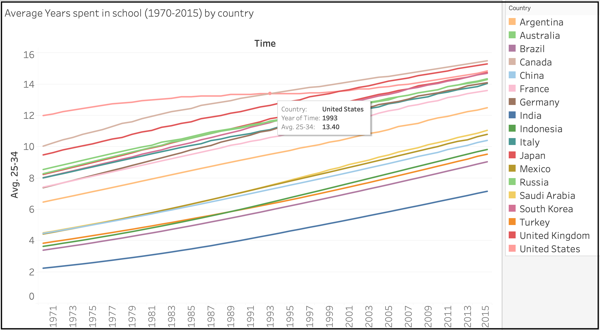

# Tableau Demo 1

&nbsp;

This demo uses Tableau to investigate the mean years spent in school among the G20 countries.
I answer the questions:

* Is the number of years spent in school always increasing, or has it declined for some nations? 
  Has growth plateaued?
* Which countries have had the greatest shift towards equality between men and women?

## The mean years spent in school dataset

The `mean_years_school.csv` dataset in Fig. 1 shows the average number of years men and women stay in school for different age brackets for 187 countries from 1970 until 2015.

*Fig.1 Mean years spent in school dataset (source:  <https://www.gapminder.org/data>)*

## Average for the 25-34 age bracket for G20 countries

By focussing on a specific age bracket we can get a good idea to the answers of our questions. 
This is a sensible choice because we don't know the relative populations for the different age brackets.
<!-- The most relevant age bracket to check is the 25 - 34 age group.  -->
Consider the average across all years of available data, Fig. 2.

*Fig. 2 Investigating the 25-34 age bracket among G20 countries. Across all available data, the USA has the largest average number of years spent in school at 13.40 years, and Australia places 5th with 11.51 years.*

* To narrow it down to the 19 countries of interest, I applied a filter to the `Country` field.
* To get an estimate for the average, I created a calculated field: `[25-34] = ([Men 25-34] + [Women 25-34]) /2`  
  It is important to note that this isn't a weighted average.
  To make the calculation more accurate, we would need each country's population data for each gender and age group in the data set by year.
  We could then alter the calculated field's formula to have weighted proportions.

On first glance of Fig. 2, it appears the USA has the largest average years spent in school.
It turns out, however, that this is due to an early lead, and that the USA is the *only* country which shows an extended plateau in the dataset. 
 This occurs in the 1990s, during which Canada and then later Japan overtakes the US for 1st and 2nd place respectively, Fig. 3. 

*Fig. 3 In 1993, Canada overtook the USA for top spot for the mean number of years spent in school in the 25-34 age group. All countries follow a roughly linear growth apart from the USA which has a plateau for a span of ~10 years starting around 1990* 

Fig. 3 answers our first question: **the average number of years spent in school is generally increasing for the G20 countries, and progress has only stalled in one country -- in the USA -- during a 10 year period in the 1990s, after which it began to increase again.**

TODO: make this prettier. Center the title, make text larger, make clickable to Tableau public.

### Rolling averages

To see how the average years spent in school has evolved over time to reach the values in Fig. 2, we can also check the rolling average.
This is a useful technique in general for investigating trends in time series data.

* Plot Avg 25-34 versus year for each country. -- just do top 5 countries.
* Also plot cumulative average, and the 5 year rolling average.

## Investigating differences between genders over time

> Which countries have the largest and smallest ratio of men:women across all years?

To get an idea about equality between men and women we can investigate the ratio, and similarly look at the rolling averages.